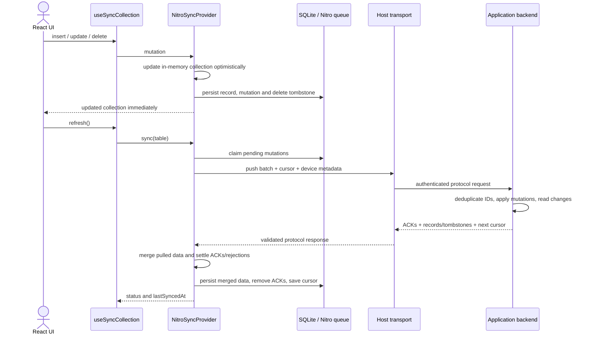
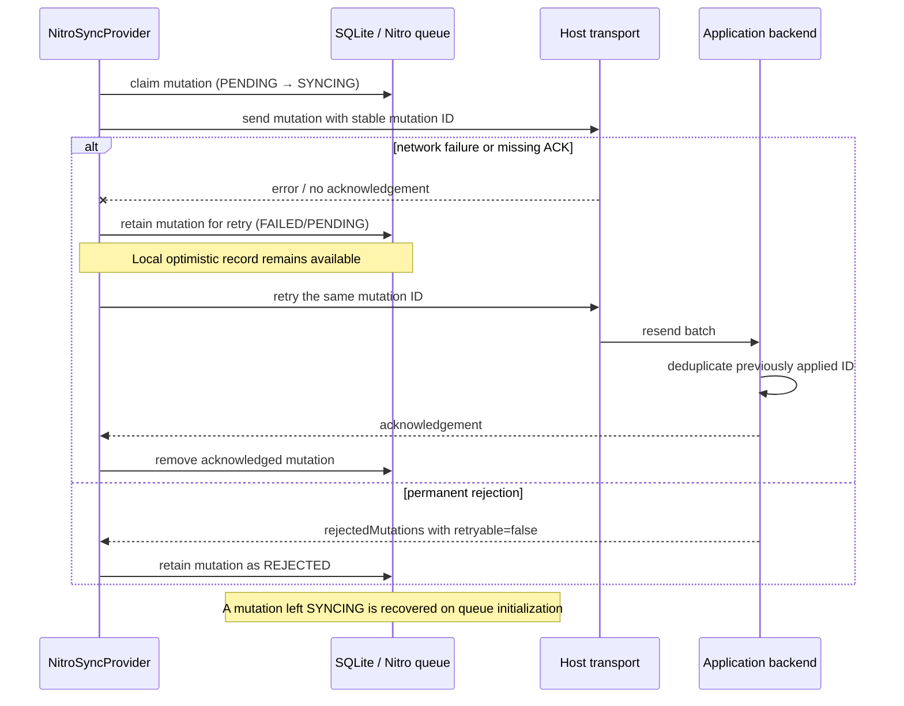

# react-native-nitro-sync

[](https://www.npmjs.com/package/react-native-nitro-sync)
[](https://github.com/raouldandresy/react-native-nitro-sync/actions)
[](./LICENSE)

Local-first and offline-first synchronization primitives for React Native. The client persists records and queued mutations locally, exposes synchronous Nitro Module queue operations, and lets the host application provide its own REST, GraphQL, or WebSocket transport.

> **Production boundary:** this package is a client-side sync library, not a backend or a complete application sync service. Its package-level validation is separate from an integrating app's backend, authentication, deployment, and background-execution guarantees. See [Production readiness](#production-readiness).

For component responsibilities, persistence, native registration, and outstanding readiness gaps, see [Architecture](./architecture.md).

## Features in this version

- Optimistic collection operations via `useSyncCollection`: insert, update, delete, and manual refresh.
- Durable local mutation queue with deduplication, retry/recovery, and per-mutation schema version.
- Atomic local queue/record writes, table-filtered claims, and capped exponential retry delay.
- Inspect and retry or discard permanently rejected mutations with their stored server code/message.
- Nitro C++ queue plus a TypeScript/OP-SQLite storage adapter and MMKV-compatible metadata storage.
- Versioned client/server request and response contract (`protocolVersion: 1`), per-table cursors, acknowledgements, and permanent/retryable rejections.
- Configurable record merge strategies and persisted delete tombstones.
- Expo config plugin and native background entry points; execution is subject to operating-system scheduling and host-app integration.
- An Expo Router example with Notes, Tasks, Sync, and Guide screens using an in-memory mock transport.

## Requirements

- React Native 0.73+ with the New Architecture enabled.
- iOS 13.4+ or Android API 24+.
- The example Android build targets `arm64-v8a` and `x86_64` so its native dependencies can be validated for 16 KB memory pages; 32-bit example ABIs are intentionally excluded.
- `react-native-nitro-modules` 0.36.5+.
- `@op-engineering/op-sqlite` 10+ is required to build the Android Nitro C++ queue, which compiles the SQLite amalgamation shipped by this package; it is also the default provider for the TypeScript storage adapter, though another provider can be used there.
- `react-native-mmkv` for persistent sync metadata in the standard setup.

## Installation

```sh
npm install react-native-nitro-sync react-native-nitro-modules @op-engineering/op-sqlite react-native-mmkv
cd ios && pod install && cd ..
```

Expo applications need a development build because Nitro Modules and SQLite require native code; Expo Go is not supported:

```sh
npx expo install react-native-nitro-sync react-native-nitro-modules @op-engineering/op-sqlite react-native-mmkv
npx expo prebuild
npx expo run:ios
# or: npx expo run:android
```

The package's `prepare` script runs Nitrogen to generate the C++ spec and platform autolinking files before building the package. Generated files are checked in for native builds; when changing the Nitro spec or `nitro.json` in a source checkout, run `npm run generate` and commit the updated `nitrogen/generated` output.

Add the config plugin to `app.json` if background-task configuration is required:

```json
{
  "expo": {
    "plugins": [
      [
        "react-native-nitro-sync",
        { "backgroundTaskIdentifier": "com.example.sync" }
      ]
    ]
  }
}
```

## Quick start

Configure one provider near the application root. The provider uses the native engine when available; an explicit SQLite adapter can be used as a fallback or directly by applications that construct their own storage.

```tsx
import { open } from "@op-engineering/op-sqlite";
import { MMKV } from "react-native-mmkv";
import type { PropsWithChildren } from "react";
import {
  NitroSyncProvider,
  normalizeSyncResponse,
  type SyncTransport,
  type SyncRecord,
} from "react-native-nitro-sync";

const database = open({ name: "nitro-sync.db" });
const metadataStore = new MMKV({ id: "nitro-sync-metadata" });

const transport: SyncTransport = {
  async pushAndPull<T extends SyncRecord>(
    tableName,
    mutations,
    lastSyncedAt,
    serverCursor,
    serverVersion,
    deviceId,
  ) {
    const response = await fetch("https://api.example.com/sync", {
      method: "POST",
      headers: {
        "content-type": "application/json",
        // Add credentials from your host app's auth/session provider here.
      },
      body: JSON.stringify({
        protocolVersion: 1,
        tableName,
        mutations,
        lastSyncedAt,
        serverCursor,
        serverVersion,
        deviceId,
      }),
    });

    if (!response.ok) {
      throw new Error(`Sync failed with HTTP ${response.status}`);
    }
    return normalizeSyncResponse<T>(await response.json());
  },
};

export function AppRoot({ children }: PropsWithChildren) {
  return (
    <NitroSyncProvider
      config={{
        sqliteDatabase: database,
        metadataStore,
        transport,
        pollingIntervalMs: 15_000,
        conflictStrategy: "last-write-wins",
        schemaVersions: { todos: 1 },
      }}
    >
      {children}
    </NitroSyncProvider>
  );
}
```

Use the collection hook from a descendant of the provider:

```tsx
import { Button } from "react-native";
import { useSyncCollection, type SyncRecord } from "react-native-nitro-sync";

interface Todo extends SyncRecord {
  title: string;
  completed: boolean;
}

export function TodoList() {
  const todos = useSyncCollection<Todo>("todos");

  return (
    <>
      <Button
        title="Add todo"
        onPress={() => todos.insert({ title: "Read locally first", completed: false })}
      />
      {todos.data.map((todo) => (
        <Button
          key={todo.id}
          title={`${todo.completed ? "✓" : "○"} ${todo.title}`}
          onPress={() => todos.update(todo.id, { completed: !todo.completed })}
        />
      ))}
      <Button title="Sync now" onPress={() => void todos.refresh()} />
      {todos.rejectedMutations.map(({ mutation, code, message }) => (
        <Button
          key={mutation.id}
          title={`Rejected (${code}): ${message}`}
          onPress={() => {
            todos.retryRejected(mutation.id);
            void todos.refresh();
          }}
        />
      ))}
    </>
  );
}
```

`insert`, `update`, and `delete` return the record ID and update local state immediately. `refresh()` resolves after the sync attempt; inspect `status` and `error` to show failures to the user. `status` is shared at provider level (`idle`, `syncing`, or `error`), as is `lastSyncedAt`. A collection hook must be rendered below `NitroSyncProvider`.

## Transport contract

The `SyncTransport` receives a batch for one table at a time. The request includes `protocolVersion: 1`, `tableName`, `deviceId`, `mutations`, `lastSyncedAt`, and optional per-table `serverCursor` and `serverVersion`. Each mutation has an immutable ID, operation, payload, timestamp, and `schemaVersion` (default `1`, configurable using `config.schemaVersions`).

An example successful response:

```json
{
  "protocolVersion": 1,
  "records": [{ "id": "todo-123", "title": "Synced", "completed": false, "updatedAt": 42 }],
  "tombstones": [],
  "acknowledgedMutationIds": ["mutation-abc"],
  "rejectedMutations": [],
  "serverTimestamp": 1730000000000,
  "serverCursor": "opaque-table-cursor",
  "serverVersion": 42
}
```

`records`, `tombstones`, acknowledgements, and rejections are optional. A tombstone contains an `id` and finite numeric `timestamp`. A rejection contains `mutationId` and `code`, and may include `message` and `retryable`; explicitly permanent rejections are retained in `REJECTED` and are not retried automatically. Unacknowledged mutations remain retryable. The response parser rejects malformed structures and unsupported protocol versions. Only acknowledgement/rejection IDs from the submitted batch are settled.

The backend must make mutation processing idempotent by mutation ID, ideally in the same transaction as its data changes. Cursor values must be stable per table and advance only past changes included in that response. The client stores a returned cursor after processing the table response; it cannot detect a server that silently skips changes. Protect the endpoint with the host application's authentication and authorization. The example `apiTransport` sends the protocol shape but does not implement a server.

## How synchronization works

### Local write and successful sync



### Failure, retry, and restart recovery



These diagrams show the intended client flow, not a guarantee of exactly-once network delivery. Delivery is retryable and at-least-once; server-side idempotency is required.

## Storage, conflicts, and deletes

The native SQLite queue schema is in [`schema.sql`](schema.sql); the C++ implementation is in [`cpp/MutationQueue.cpp`](cpp/MutationQueue.cpp). The exported `createSyncStorage(database, metadata)` creates the OP-SQLite adapter. Both queue implementations deduplicate by mutation ID without replacing the original mutation payload. Queue migrations use `user_version` through version 5 and preserve existing queued work. A mutation left `SYNCING` is recovered at initialization. Local mutations and their materialized records/tombstones are written in a single transaction. Failed mutations use an exponential retry delay capped at five minutes. Permanent rejections can be inspected through `rejectedMutations`, then retried or discarded using `retryRejected(id)` / `discardRejected(id)`. Discarding stops future delivery but does not roll back the optimistic record; reconcile that local record explicitly if required.

Structured records, queue state, and tombstones belong in durable SQLite storage. The metadata store (for example MMKV) holds device ID, `lastSyncedAt`, and per-table cursors/versions. Avoid using metadata storage as the source of truth for records.

Choose `config.conflictStrategy` from:

- `last-write-wins` / `lww`: choose the record with the later comparable update timestamp.
- `server-wins`: choose the pulled server record on conflict.
- `client-wins`: preserve the local record on conflict.
- `merge-fields`: recursively merge JSON objects; remote values replace scalar and array conflicts. This is not a causal or CRDT merge.
- A custom resolver `(local, remote, mutation?) => record`; it must preserve the record ID.

The client-side strategy does not automatically configure server behavior. The backend must use compatible rules if replicas are to converge. Use server-controlled, comparable revisions for multi-device conflict resolution; device wall clocks alone are not a reliable global ordering.

Offline deletes are persisted as local tombstones. They hide matching records and suppress pulled rows unless a pulled row has a strictly newer numeric `updatedAt` or `updated_at` revision. The server may return authoritative tombstones. A matching acknowledged delete clears only the local tombstone it covers; newer deletes remain. Unversioned remote records cannot override a tombstone.

## Background work and benchmarking

The Expo plugin and native entry points configure/schedule platform background work, but they do not run the application's authenticated transport automatically. The host must wire a background delegate/handler and credentials. iOS and Android may defer or skip work; background execution is best-effort. Resume and drain the durable queue when the app starts or returns to the foreground.

`benchmarkNativeSyncQueue` measures serialization, queue enqueue/claim, payload sizes, and event-loop delay for synthetic batches against the Nitro queue. The helper is available, but the measurements must be run by the integrating app on its target hardware: this repository's unit tests use a fake queue and are not device performance results. For useful production data, run release builds on representative physical iOS and Android devices, record OS/device/build details, repeat runs, and include the application's actual payload sizes and queue workloads. Simulator timings are useful for functional checks only, not representative device-performance claims. The benchmark does not measure native heap usage or battery consumption and has no device-independent performance thresholds.

## Example app

The Expo Router demo lives in [`example/`](example/). It includes:

- **Notes:** local create, edit, delete, and collection status.
- **Tasks:** a second independently synchronized table and optimistic updates.
- **Sync:** manual per-table sync, mock server counters, and an intentional transport-failure/retry exercise.
- **Guide:** client sync lifecycle and explicit boundaries of the mock.

The demo transport is in-memory and resets when the process exits. It is for learning and local testing only; it is not a production backend. Follow [`example/README.md`](example/README.md) to run the app and configure a real endpoint.

## Production readiness

**Library-level validation:** the package's test suite, protocol fixture tests, package build, Android Release bundle, Android 16 KB runtime check, and iOS Release simulator build/runtime check have been completed. These validate the library and its native integration in the example; they are distinct from validating any particular consumer application's backend or deployment.

The backend is deliberately not bundled: applications choose and operate their own backend and transport. Its absence is an architectural boundary, not a package-level readiness defect. The repository has unit coverage for protocol validation, storage, merge policies, lifecycle settlement, and the benchmark helper, plus a local Node HTTP protocol fixture with nine contract tests. The example was connected to that fixture from an Android 16 KB emulator and successfully sent two local notes through `POST /sync`, then read them back from the backend snapshot API. The Android Release AAB and iOS Release simulator app have both built locally; both were also exercised in simulators.

The following are **consumer-application integration responsibilities**, not prerequisites for validating this library package:

1. Contract-test the application's selected backend, including atomic mutation-ID deduplication, cursor consistency, rejection semantics, authentication, and delete/conflict behavior.
2. Exercise the complete app/backend workflow, including concurrent edits, lost acknowledgements, upgrades, and recovery across devices.
3. Integrate the application's credentials, data lifecycle, error/rejection UX, and any background execution handler.
4. Measure performance on representative hardware when the application needs device-specific latency, memory, or battery guarantees.

The Android native library requests 16 KB ELF segment alignment. The example targets 64-bit ABIs only, and CI builds its APK and checks every packaged shared library's ELF load segments and ZIP alignment. The Release AAB has also been built with the standard lint tasks enabled and validated: all 52 native libraries across `arm64-v8a` and `x86_64` have 16 KB ELF load-segment alignment. The release app was installed and exercised on a 16 KB-page Android emulator; a locally saved note remained after restarting the app. The example AAB uses the debug signing key and is not suitable for publication. CI also builds the iOS example in Release configuration for the simulator. Signed device releases and physical-device testing are required only when validating a consumer app's release/deployment claims.

### Protocol and performance checks

The repository includes a loopback-only Node.js backend for exercising protocol version 1 without choosing a production backend. It keeps per-table records and cursors in memory, deduplicates mutation IDs, returns tombstones and rejections, and supports deterministic lost-ACK/rejection test headers. It is a test fixture, not a deployable or secure production service.

Run the HTTP contract tests and backend throughput benchmark with Node.js 18 or newer:

```sh
npm run test:sync-contract -- --runInBand --watchman=false
npm run benchmark:sync-backend
```

The benchmark reports p50/p95 HTTP round-trip latency and mutations per second for configurable batch sizes, JSON payload sizes, and concurrency. For a different workload, set `SYNC_BENCH_BATCHES`, `SYNC_BENCH_PAYLOADS`, `SYNC_BENCH_CONCURRENCY`, and `SYNC_BENCH_ITERATIONS` to comma-separated positive integers (iterations must be at least 2). A Node 22/Apple Silicon run with 30 iterations per worker measured about 88k mutations/s for 100 × 256-byte mutations at concurrency 1 (HTTP p50 0.93 ms / p95 1.55 ms) and 102k mutations/s at concurrency 4 (p50 3.36 ms / p95 5.73 ms); these characterize only the test fixture. The native SQLite/Nitro queue benchmark was also run in the Android 16 KB emulator development build: medians for 10/50/100 mutations were 6.63/28.89/51.42 ms enqueue and 1.34/2.29/3.72 ms claim. These measurements exercise the bounded benchmark path; use them as environment-specific observations, not universal performance guarantees. The on-device benchmark uses batches up to 100 mutations (the provider's current sync batch limit), yields periodically to keep the UI responsive, and displays completed batch results incrementally. It covers queue insertion/claiming and JS event-loop delay; it does not measure memory, battery, full network sync, or enforce universal performance thresholds.

The sample in-memory server is only a protocol fixture, and operating-system background scheduling does not guarantee delivery. Applications must supply their own durable backend and foreground/resume recovery policy. See [Architecture](./architecture.md) for implementation details and boundaries.

## Development

```sh
npm install
npm run lint
npm test -- --runInBand --watch=false
npm run typecheck
npm run build
```

For the Expo demo:

```sh
cd example
npm install
npx expo start
```

Use a development build (`npx expo run:ios` or `npx expo run:android`) to exercise native modules; Expo Go cannot load Nitro Modules.

## Security

Please read [`SECURITY.md`](SECURITY.md) before reporting a vulnerability. Enable GitHub Dependabot alerts and security updates in the repository settings; the committed [`dependabot.yml`](.github/dependabot.yml) configures dependency update pull requests.
