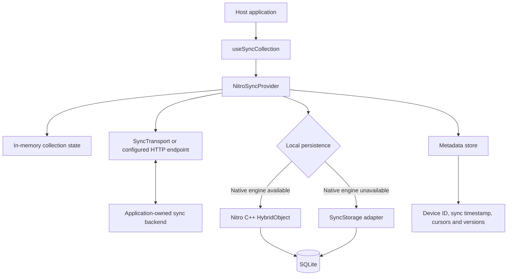

# Architecture

This document describes the implementation in this repository, not a guaranteed server protocol or a production deployment recipe. The package is a client-side synchronization library: applications own the backend, authentication, transport policy, and background execution integration.

## System overview

The provider is the orchestration boundary. Hooks expose optimistic collection operations and refresh; the transport exchanges versioned requests and responses; the native engine or storage adapter persists the local queue and records. The package does not include a production backend.

## Components

| Component | Responsibility |
| --- | --- |
| `src/provider.tsx` | Initializes storage, owns collection state, applies optimistic mutations, serializes sync calls, merges responses, and settles queue entries. |
| `src/hooks/useSyncCollection.ts` | Exposes typed records plus insert, update, delete, and table-scoped refresh. |
| `src/protocol.ts` | Builds protocol-versioned requests and validates/normalizes transport responses. |
| `src/merge.ts` | Parses persisted payloads, resolves record conflicts, and applies tombstones. |
| `src/mutationSettlement.ts`, `src/stateMachine.ts` | Partition acknowledgements and rejections and describe queue lifecycle transitions. |
| `src/storage.ts` | Defines the synchronous SQLite/metadata interfaces and implements the TypeScript SQLite-backed queue and record store. |
| `src/specs/NitroSync.nitro.ts` | Defines the Nitro HybridObject API consumed by JavaScript. |
| `cpp/` | Implements the synchronous SQLite queue and record/tombstone persistence shared by iOS and Android. |
| `nitrogen/generated/` | Checked-in Nitrogen C++, Kotlin, Gradle, and iOS autolinking outputs. Regenerate after spec changes with `npm run generate`. |
| `plugin/src/index.ts` | Expo config plugin for the iOS permitted task identifier, Android background permissions, and Kotlin Gradle plugin configuration. |

## Mutation and synchronization flow

### Local writes

1. A collection hook calls the provider's `mutate` function.
2. The provider validates the configured table schema version and creates a mutation ID and record ID.
3. It atomically enqueues the mutation and persists the current record or deletion tombstone.
4. Only after persistence succeeds does it update the in-memory collection optimistically. Provider initialization requires either the Nitrogen-backed native engine or an explicitly configured persistent `SyncStorage`/SQLite adapter.

The queue stores `CREATE`, `UPDATE`, and `DELETE` mutations with timestamp and schema version. Queue statuses include `PENDING`, `SYNCING`, `FAILED`, and `REJECTED`; acknowledged entries are removed. SQLite migration state is tracked with `PRAGMA user_version` and currently advances through schema version 5.

### Sync

1. `sync()` serializes calls through a provider-owned promise chain.
2. It claims up to 100 oldest eligible pending/failed mutations. A table-scoped refresh claims directly from that table.
3. Mutations are grouped by table and sent through `pushAndPull`, together with the last sync timestamp, per-table server cursor/version, device ID, and protocol version.
4. The response is normalized. Pulled records are merged with local records and outstanding local mutations using the configured conflict strategy; tombstones prevent deleted records from being reintroduced.
5. Acknowledged mutations are removed, permanent rejections are marked `REJECTED`, and unacknowledged/retryable mutations are marked `FAILED`.
6. The response's cursor/version and the latest sync timestamp are persisted for later requests.

The backend must deduplicate mutation IDs atomically with its own changes and return cursors that do not skip changes. The client cannot detect a backend that advances a cursor past omitted records. A global request batch limit of 100 is used; this is not a server pagination protocol.

## Persistence

| Data | Standard native path | Adapter path |
| --- | --- | --- |
| Queue and mutation payloads | Nitro C++ backed by SQLite | `SyncStorage` backed by synchronous SQLite calls |
| Current records and deletion tombstones | Nitro C++ backed by SQLite | Same SQLite database through `SyncStorage` |
| Device ID, last sync time, per-table cursor/version | Metadata methods on the configured storage/metadata store | MMKV-compatible `SyncMetadataStore`, or metadata methods on custom `SyncStorage` |
| Rendered collection data | Provider memory, loaded from persistence when a table is ensured | Same |

The native queue and record store use the app's private database directory on Android; iOS uses the configured database path. Android compiles the SQLite amalgamation shipped by `@op-engineering/op-sqlite`, which is therefore required for Android builds even when another storage adapter is used at runtime. The TypeScript adapter also expects synchronous database methods.

Queue insertion and the corresponding record/tombstone write are one SQLite transaction on both storage paths. The in-memory optimistic state is updated only after that transaction succeeds. Applications must still make backend processing idempotent by mutation ID because network delivery is at least once.

## Native integration and generation

The TypeScript spec is the source for the Nitro HybridObject contract. Nitrogen generates and links the platform bindings:

- **Android:** `NitroSyncPackage` initializes generated native registration and supplies the app-private database directory. CMake compiles the queue with the OP-SQLite SQLite amalgamation and requests 16 KB ELF segment alignment. The module consumes Prefab dependencies but does not publish Prefab packages; enabling `prefabPublishing` without exported packages leaves an unset provider in the local lint AAR task. The example targets only `arm64-v8a` and `x86_64`, because its third-party 32-bit libraries remain 4 KB-aligned.
- **iOS:** the podspec includes the C++ queue and generated Nitro autolinking files. The old custom linker workaround is not part of the registration path.
- **Generated output:** files under `nitrogen/generated/` are checked in so consumers can build from the package. Changes to the spec or `nitro.json` require regenerating and committing those files.

The package requires the React Native New Architecture and a development/native build; Expo Go cannot load the Nitro module.

## Background execution boundary

The Android WorkManager worker and iOS BackgroundTasks wrapper provide scheduling entry points, not an automatically authenticated sync client. Host applications must supply the delegate/handler and credentials. Operating systems can defer or skip execution, and the iOS wrapper suppresses task-submission errors. Foreground/resume sync and a durable queue remain necessary; background scheduling is best-effort only.

Failed mutations receive exponential retry delay beginning at one second and capped at five minutes. Permanent server rejections persist their code and message in the queue and are available through the collection hook's `rejectedMutations` list. Call `retryRejected(id)` to explicitly return one to the queue or `discardRejected(id)` to remove it. Discarding only removes the queue item; it does not roll back its optimistic record. Retryable server rejections and missing acknowledgements use the automatic retry path.

## Readiness review

The previously identified client-side correctness issues have been addressed: omitted cursor/version fields preserve stored values; table-scoped claims query only the requested table; provider initialization requires a native engine or explicit persistent storage; local queue and record writes are transactional; rejected mutations are inspectable and recoverable; retries use capped exponential backoff; CI now runs typecheck, lint, tests, and package build; and `SECURITY.md` matches the published 1.x line without a placeholder email.

**Android release checks completed:** the example Release AAB builds with the standard lint tasks enabled, passes `bundletool validate`, and contains only 16 KB-aligned native ELF segments for `arm64-v8a` and `x86_64`. The release app was installed on a 16 KB-page emulator; a local note persisted across an app restart. The example AAB is signed with the debug key and is not a publishable artifact.

**iOS simulator check completed:** the example generated project and CocoaPods installed successfully; the Release simulator build succeeded with Xcode 26.4 and the app launched on an iPhone 17 simulator. CI now includes the same iOS Release simulator build. This validates compilation and simulator startup, not a signed physical-device release or device-specific behavior.

**Protocol and performance checks:** nine HTTP contract tests exercise deduplication, conflicting mutation IDs, lost ACK recovery, per-table cursors, tombstones, conflict revisions, retryable/permanent rejection, validation, and fixture health/reset endpoints. The Android 16 KB emulator example was pointed at the Node fixture over HTTP; syncing two local notes produced two server-side records and incremented the server's request/mutation counters. The benchmark runner measured the fixture on Node 22/Apple Silicon; a separate Android development-emulator run measured native enqueue/claim at batches 10, 50, and 100. Both are useful repeatable baselines, not capacity claims for a production service or representative physical-device performance.

**Consumer-application integration responsibilities:** contract-test the backend selected by an integrating app, connect its authentication and background handler, define rejection/recovery UX, and measure representative-device resource usage when the app needs those guarantees. The in-memory HTTP fixture validates the client protocol path; it is intentionally not a production backend. These app-specific checks are not prerequisites for compiling and validating the library package itself. CI builds the Android example APK and checks all packaged ELF load segments and ZIP alignment, and builds the iOS example for the simulator.

**Readiness conclusion:** package-level validation is complete for the tested scope: automated unit/contract tests, package build, Android Release bundle and 16 KB emulator runtime, and iOS Release simulator build/runtime all pass. No package-level release blocker has been identified by these checks. This conclusion does not certify an integrating app's backend, credentials, production deployment, signed device release, or background-delivery guarantees.
